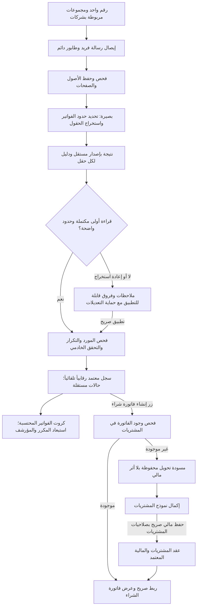

# خطة بناء صندوق وارد فواتير WhatsApp

- **المرجع المعماري:** `BASEER-ARCH v1.0`
- **قرار الحد:** `ADR-WAI-001-WHATSAPP-INVOICE-MONITORING-BOUNDARY.md`
- **بطاقة الأثر:** `BASEER-IMPACT-2026-09-05-WHATSAPP-INVOICE-MONITORING`
- **الحالة:** خطة G0–G3؛ لا تنفيذ أو اعتماد أو اتصال حي قبل اعتماد البوابات.
- **نسخة العقد:** `WAI v2` — التحسينات السبعة المطلوبة؛ مواصفة تصميم قابلة للمراجعة وليست كوداً منفذاً.

## الهدف والنتيجة

يتلقى رقم WhatsApp مخصص واحد صور وملفات PDF للفواتير من مجموعات خاصة متعددة. تربط كل مجموعة
بشركة واحدة في Baseer بواسطة `groupJid`، لا باسمها. تحفظ الملفات في تخزين خاص؛ الفاتورة
كيان مستقل يضم صفحات من ملف أو عدة ملفات، وقد يحتوي PDF واحد عدة فواتير. يظهر لكل
فاتورة صف واحد بالمورد والرقم والمبالغ، ولا تعد الصور أو الرسائل فواتير تلقائياً. يصل السطر
السليم معتمداً **رقابياً** افتراضياً وقابلاً للتعديل؛ لا تعني هذه الحالة اعتماد شراء
أو قيداً أو رصيداً أو تعديلاً للمورد الرئيسي.

أمثلة العرض فقط: ARZ ↔ `ARZ INV`، المعلم الشامي ↔ `SHAMI INV`، دوحة المستهلك ↔
`PLASTIC INV`. تغيير الاسم لا يكسر الربط ولا يغير الشركة.

## الفريق ومسؤولياته

| الدور | مسؤولية القرار أو التسليم |
|---|---|
| قائد البناء ومحلل الرحلات | عقد المستخدم، الشرائح وترتيب البوابات |
| كبير المعماريين | حدود المجال والعقود وschema وعزل الشركة |
| خبير ERP | منع الأثر المالي/الشرائي واختبارات عدم التغيير |
| خبير دمج وAI | موصل WhatsApp، جلسة الاعتماد، OCR غير الموثوق والتقييم |
| بنّاء الخدمة والبيانات | API، worker، طابور، معاملات، مفاتيح منع التكرار |
| مهندس السعة والتشغيل | استعادة الانقطاع، التخزين والاحتفاظ، السجلات والتنبيهات |
| أمين المكتبات | تقييم Baileys/WPPConnect، الترخيص وSBOM والثغرات والتوافق |
| مصمم التجربة وبنّاء الواجهة | صفحة الربط، الجدول، المراجعة، الجوال وRTL/LTR |
| حارس الجودة وحارس البوابات | اختبارات السلوك، مراجعة مستقلة وإقفال كل بوابة |

## موضع القسم وشكله

### الاسم المعتمد

**وارد فواتير واتساب**

هذا الاسم يشرح مصدر الإدخال فوراً ولا يوحي بأنها «فواتير شراء» معتمدة أو مرّحلة.
يمكن مستقبلاً أن يصبح الاسم الأب «وارد فواتير الموردين» عند إضافة بريد أو رفع يدوي؛
لا نغيّر الاسم في الإصدار الأول بلا مصدر ثانٍ.

### المكان في التنقل

```text
العمليات
├─ المشتريات
├─ وارد فواتير واتساب  ← القسم الجديد
├─ المصروفات والالتزامات
└─ الموردون
```

يوضع مباشرة **بعد «المشتريات» وقبل «المصروفات والالتزامات»** كعنصر أولي مستقل، لا
داخل قائمة فرعية؛ هذا يبقيه على بعد نقرة واحدة من فواتير الشراء ومن قائمة الموردين.
لا يوضع في المالية ولا في المستندات: ترتبط رحلة المستخدم بالمورد ومسودة الشراء، لكن
يبقى مصدر الحقيقة المالية في دورة المشتريات/المالية. مكتبة المستندات تظل بنية
التخزين والوصول فقط، وليست مكان العمل أو الجدول.

### واجهة القسم

1. عنوان «وارد فواتير واتساب» مع حالة الرقم: متصل/منقطع/يلزم QR.
2. صف كروت مشترك فوق التبويبات: الفواتير المحتسبة، المكررة، تحتاج تدخلاً، والإجمالي
   الرقابي شامل الضريبة لكل عملة. تبين مصغرات الملفات عدد الملفات بصورة مستقلة عن الفواتير.
3. فلاتر مركزية تحت الكروت: التاريخ (يوم/شهر/نطاق) وأساسه (استلام/فاتورة)، حالات السجل، المورد،
   المجموعة، وزر تصدير. يظل النطاق المختار عند الانتقال بين التبويبات.
4. التبويبات الخمسة تظهر تحت الفلاتر بالترتيب: **الصور والملفات**، **جدول الفواتير**،
   **الملاحظات**، **الأرشيف**، **إعدادات الربط**.
5. تبويب «الصور والملفات»: مصغرات قابلة للنقر للصور وأول صفحة PDF، عرض كبير مع
   تكبير/تدوير وحفظ نسخة عرض مدورة غير متلفة للأصل؛ مؤشرات تسجيل الجدول والاستخراج
   وعدد الفواتير المرتبطة وزر إعادة الاستخراج أسفل كل ملف. تتاح إدارة الصفحات لضم
   صور فاتورة واحدة أو فصل PDF متعدد الفواتير؛ تعرض حالة الصفحات التي لم تسجل بعد.
6. تبويب «جدول الفواتير»: جدول متجاوب وتحميل تدريجي cursor/virtualized لنطاق الشهر؛
   صورة/‏PDF، المورد، رقم الفاتورة، الرقم الضريبي، قبل الضريبة، الضريبة، الإجمالي،
   الحالة، المجموعة، وتاريخ الاستلام. السطر المكرر يحمل شارة ولون تحذير.
7. تبويب «الملاحظات»: المكررة والاستثناءات وفشل الاستخراج والمجموعات غير المربوطة،
   مع فلتر داخلي لنوع الملاحظة. تبويب «الأرشيف» للاستعادة. تبويب «إعدادات الربط»
   إداري للرقم والمجموعات؛ تبقى الكروت ظاهرة فيه لكن فلاتر الفواتير لا تغير إعداداته.
   يحفظ التنقل الفلاتر وموضع التمرير؛ حالة التبويب لا تغير تعريف الإجمالي العام.
8. الضغط على سطر أو مصغرة يفتح لوحة تفاصيل: معاينة الملف، البيانات المستخرجة والقابلة
   للتعديل، سجل التغييرات، علاقة التكرار، «أرشفة»، و«إنشاء فاتورة شراء» عند توفر شروطه.

## البنية المستهدفة



### حدود بيانات G2 المقترحة

هذه أسماء تصميمية قابلة للتعديل قبل migration، وليست schema منفذة:

| الكيان | الغرض والقيود |
|---|---|
| `WhatsappConnection` | رقم واحد وحالة الاتصال؛ session credential مشفر خارج Git، وQR قصير العمر لمسؤول الربط فقط |
| `WhatsappGroupBinding` | `tenantId + companyId + groupJid`، اسم عرض متغير، وحالة ACTIVE/PAUSED/REVOKED؛ يمنع groupJid النشط مرتين داخل المستأجر |
| `WhatsappInboundMessage` | إيصال واحد لكل `connectionId + groupJid + whatsappMessageId`، مستقل عن عدد الفواتير؛ connection ثابت عبر إعادة QR، وتثبت companyId وbindingRevision عند الإدخال |
| `InvoiceMonitorAsset` | أصل محفوظ وبصمته ونوعه وحجمه وإيصال المصدر؛ unique على messageId وattachmentIndex |
| `InvoiceAssetPage` | صفحة أصلية بهوية ثابتة ورقمها، وإصدارات عرض منفصلة للتدوير؛ الصورة صفحة واحدة |
| `InvoicePageAssignment` | ربط صفحات أو مناطق محددة بفاتورة وترتيبها ضمن sourceRevision؛ يدعم عدة ملفات لفاتورة وعدة فواتير لملف |
| `InvoiceMonitoringRecord` | هوية الفاتورة وقيمها الفعلية وrowVersion وsourceRevision؛ حالات مستقلة موضحة أدناه |
| `InvoiceExtractionRevision` | نتيجة غير قابلة للاستبدال؛ sourceRevision/model/prompt/schema وإيصال تشغيل بصيرة، والقيمة والدليل لكل حقل |
| `InvoiceMonitoringReview` | تطبيق فروق أو تصحيح يدوي، old/new وفاعل ووقت وfield provenance، مع منع الكتابة فوق rowVersion أحدث |
| `InvoiceDuplicateAssessment` | نتيجة فحص مؤرخة مع fingerprint للقيم الحالية وعلاقة بالأصل؛ قرار ليست مكررة مرتبط ببصمة المقارنة |
| `InvoicePurchaseLink` | مسودة التحويل أو مستند شراء موجود، لقطة قيم المصدر ونسخته وحالة الربط؛ سجل تاريخي وروابط فعالة مقيدة |

كل علاقة مركبة تتحقق من tenant/company في الخادم وقاعدة البيانات؛ لا ربط صفحات أو
مورد أو فاتورة شراء من شركة أخرى. إعادة ربط مجموعة لا تنقل فواتيرها أو مهامها القديمة؛
الرسالة التاريخية الملتبسة وقت تبديل الربط تدخل الملاحظات حتى يحسم مسؤول الربط ملكيتها.

الموصل وبصيرة لا يستدعيان إنشاء أو ترحيل مستند مالي. جسر التحويل يملك مسودة غير
مالية ويفتح نموذج المشتريات؛ الإجراء المالي الصريح ينفذ حصراً في مالك المشتريات.

### فصل الملف عن الفاتورة

- 3 صور لفاتورة واحدة = 3 أصول/صفحات، وفاتورة واحدة محتسبة. PDF من 6 صفحات لفاتورتين
  = أصل واحد و6 صفحات وفاتورتان. لكل فاتورة روابط إلى صفحاتها ودليلها فقط.
- تقسيم أولي واضح من بصيرة يمكنه إنشاء السجلات بصورة idempotent. عند الالتباس يعرض
  اقتراح تقسيم/ضم ولا يحسب الملف كاملاً كفاتورة إضافية؛ المصغرات تبقى متاحة.
- يدعم المحرر ضم صور، فصل نطاق صفحات، وتحديد منطقة عندما توجد فاتورتان في الصفحة
  نفسها. لا يجوز احتساب نفس منطقة المصدر مرتين. تكرار الصورة برسالة جديدة حالة مستقلة
  لفحص التكرار، لا فقد للأصل الثاني.
- يعالج تعديل حدود الفواتير بمعاملة واحدة وsourceRevision جديد؛ يحفظ lineage ويستبعد
  السجلات المستبدلة من العد دون محوها. يمنع تغيير تقسيم فاتورة لها ربط مشتريات فعال
  حتى يحسم الربط في مساره المخصص. المبالغ بعد التقسيم تعاد قراءتها ولا توزع بالتخمين.

### حالات مستقلة وقاعدة الاحتساب

| البعد | الحالات المقترحة |
|---|---|
| الاستخراج | `NOT_REQUESTED / QUEUED / RUNNING / SUCCEEDED / FAILED`؛ فشل محاولة جديدة لا يمحو النتيجة السابقة |
| جودة القيم الفعلية | `VALID / INCOMPLETE / CONFLICT`؛ تقاس على آخر قيم مطبقة لا نتيجة معلقة |
| الاعتماد الرقابي | `APPROVED_MONITORING` تلقائي عند سلامة القيم والحدود، أو `INCOMPLETE` |
| التكرار | `UNCHECKED / CLEAR / SUSPECTED / CONFIRMED / DISMISSED` |
| الأرشفة | `ACTIVE / ARCHIVED` مع من/متى/سبب، مستقلة عن التكرار والاستخراج |
| المشتريات | `NOT_LINKED / PREPARING / DRAFT_LINKED / DOCUMENT_LINKED / CANCELLED` |

الاحتساب يتطلب فاتورة فعالة معتمدة رقابياً وقيم صالحة وحدود صفحات مستقرة وتكرار
`CLEAR` أو `DISMISSED` بفحص حديث مطابق للقيم. لا يكفي label الاعتماد وحده. ربطها
بالمشتريات لا يحتسبها مرة إضافية ولا يسقطها من مجموع المراقبة. حجز الملف أمنياً
حالة للملف، وتنعكس على أهلية الفاتورة؛ ليس بديلاً لحالة الأرشفة.

### إعادة الاستخراج والتدوير

- كل طلب يحدد invoiceId وsourceRevision وbaseRowVersion وidempotencyKey. لا يعيد
  إنشاء invoiceId أو assignment. إعادة الاستخراج من ملف متعدد الفواتير تختار السجلات
  المعنية وتنتج نتيجة مستقلة لكل سجل.
- تحفظ النتيجة الجديدة كاقتراح. لا تمحو الحقول اليدوية، حتى إن صار الحقل فارغاً بتعديل
  المستخدم. يعرض diff بالقيمة الحالية والمقترحة ومصدر كل منهما؛ التطبيق صريح لكل حقل
  أو مجموعة حقول، بإذن التعديل وفحص rowVersion داخل المعاملة.
- عند تغير القيم أو الصفحات أثناء التشغيل، تصبح النتيجة قديمة للمقارنة فقط. لا تطبق
  تلقائياً. التحديث المتزامن المرفوض يعاد عرضه للمستخدم بدلاً من فقد تعديلاته.
- التدوير يحفظ displayRevision غير متلف للأصل. لا يغير invoiceId أو هوية صفحات
  المصدر أو بصمة الأصل أو العدد/المجموع. استعمال العرض المصحح في قراءة جديدة يسجل
  نسخته وتحويل الإحداثيات إلى الصفحة الأصلية؛ لا ينشئ فاتورة جديدة.

### ربط الاستخراج ببصيرة

مسار الاستخراج المعتمد هو **محلل المستندات البصري في بصيرة**، لا مفتاح أو استدعاء
مباشر من موصل WhatsApp إلى مزود خارجي. بعد أن يحفظ worker الملف ويتحقق من نوعه
وحجمه، يمرر مرجعاً أو bytes محكومة فقط إلى runtime بصيرة الخادمي. يعيد بصيرة JSON
صارماً للحقول المرصودة: المورد المرشح، رقم الفاتورة، التاريخ، الرقم الضريبي، العملة،
قبل الضريبة والضريبة والإجمالي، مع الدليل والتحذيرات ودرجة الثقة لكل حقل.

دليل التنفيذ عند مراجعة `664b6266`: المهارة `inbound.document_intelligence` في
`apps/api/src/ai-platform/ai-skills.ts` حالتها `PLANNED`؛ و`analyze` في
`apps/api/src/inbound-evidence/inbound-evidence-document-intelligence.service.ts`
يرفض التشغيل صراحة. `analyzeLegacyDirect` و`analyzeDocument` مرجعان لإعادة الاستخدام
بعد نقل المسار إلى runtime المشترك، وليس وجودهما دليلاً على جاهزية الخدمة.

#### عقد الطلب والنتيجة

- الطلب: سياق tenant/company وهوية عامل مخولة، invoiceId أو partition job للقراءة
  الأولى، sourceRevision، قائمة assetId/pageId/region/rotationRevision، checksums،
  baseRowVersion، schemaVersion/promptVersion وidempotencyKey. لا يقرأ النموذج مسارات
  أو روابط حرة يقدمها العميل؛ تحل الخلفية مراجع الملفات بعد التفويض والفحص.
- النتيجة: نوع المستند وحدود كل فاتورة، supplierName وsupplierTaxNumber، invoiceNumber،
  invoiceDate، currencyCode، netAmount/taxAmount/grossAmount، وwarnings. المفاتيح مطلوبة
  والقيمة المفقودة `null` لا صفر؛ لكل حقل pageId وregion/مقتطف ومصدر القراءة وثقة إن
  توفرت. هوية المورد النهائية من النظام لا من معرف يخترعه النموذج.
- الحقول النقدية raw strings تحفظ كما قرئت، ثم تتحقق الخلفية بDecimal وبحد منزلتين
  للقيم المطبقة؛ الدقة الزائدة أو تعارض العملة يظهر كملاحظة، ولا يصحح المصدر صامتاً.
  التحقق من الإجمالي يميز الخصم والرسوم والتقريب إن ظهرت؛ لا يفرض نسبة ضريبة مفترضة.
- كل فاتورة متعددة الصفحات تعالج كوحدة وثيقة، وتقسيم الطلبات الكبيرة يحفظ خريطة
  الصفحات والحدود. لا تعتبر معالجة كل صفحة فاتورة مستقلة. لا يخترع النظام الحقول
  الناقصة ولا يعتمد رقم ثقة النموذج وحده كاحتمال صحة مقاس.

#### حدود التشغيل المقترحة للقياس

هذه defaults تصميمية للاختبار، قابلة للضبط قبل تفعيل المزود، وليست سعة مثبتة:

| البند | العقد |
|---|---|
| حجم الأصل | حتى 10 MiB؛ PDF حتى 50 صفحة. تجاوز الحد يحفظ ملاحظة ولا يبتلع الملف صامتاً |
| دفعة القراءة | حتى 5 صفحات لكل استدعاء مع حفظ سياق وحدود الفاتورة؛ حد المزود الأقل هو الحاكم |
| المهلة | 90 ثانية للاستدعاء؛ 10 دقائق ميزانية تشغيل فعلي للطلب الكامل، دون زمن الانتظار في الطابور |
| التوازي | استدعاء واحد لكل شركة و2 إجمالاً في البداية؛ يثبت G6 الأرقام المناسبة |
| المحاولات | 2 كحد أقصى: أصلية + إعادة واحدة لأخطاء عابرة، بتأخير يبدأ من 30 ثانية مع jitter؛ لا retry خفي من SDK |
| النتيجة المجهولة | timeout بعد احتمال بدء التنفيذ لا يعاد آلياً حتى يسجل استهلاكاً محتملاً ويعاد حجز ميزانية؛ لا وعد بمنع فاتورة المزود مرتين |
| سقف الاستهلاك | حجز مسبق وفق نسخة سعر معتمدة وحدود نموذج/صفحات، وسقف للشركة والطلب. الميزانية غير المحددة تمنع الاتصال المدفوع فقط |
| الإعادة اليدوية | execution جديد مدقق بميزانية جديدة؛ replay لنفس المفتاح يعيد إيصالاً سابقاً ولا يستدعي المزود |

تتحقق بوابات المهارة والشركة والاعتماد المشفر والخصوصية والميزانية قبل إرسال bytes.
فشل المزود أو تعطيله يترك الملف والتعديلات السابقة متاحين للإدخال اليدوي. تعرض
التكلفة المقاسة والمحاولات والمهلة في سجل التشغيل دون كشف الملف أو السر في logs.

#### تقييم الدقة والجاهزية

مجموعة اختبار مقترحة من 100 فاتورة اصطناعية أو منقحة ومصرح بها: عربية وإنجليزية
ومختلطة، متعددة الصفحات، عدة فواتير في PDF، فواصل وأرقام عربية، أسماء متشابهة،
خصومات/تقريب، صفحات ناقصة، وتدوير. يفصل جزء اختبار لا يستخدم لضبط التوجيهات.
تسجل exact-match لكل حقل، صحة التقسيم وعدد الفواتير، نسبة القيم المختلقة، التصحيح
اليدوي، P95 والتكلفة لكل فاتورة. هدف أولي للمجموعة الواضحة: 98% لكل من رقم الفاتورة
والرقم الضريبي والمبالغ، مع 0 حقول مفقودة حُولت لصفر في الاختبارات السلبية؛ هذه أهداف
وليست نتائج. تشمل صلاحية الاعتماد التلقائي صحة التقسيم والتحقق الحتمي وفحص التكرار،
وتثبت أخطاؤها المقاسة قبل تفعيلها. لا يعلن مسار بصيرة جاهزاً حتى توجد أدلة تشغيل
runtime، receipts/usage، isolation، فشل/retry، وتقييم بهذه المقاييس.

## عقد السلوك

1. لا يقبل الموصل إلا حدث وسائط من `@g.us` لمجموعة مرتبطة ونشطة: صور مسموحة وPDF
   فقط بعد فحص MIME الفعلي والبصمة والحجم. غير المربوط يسجل استثناء metadata أدنى
   بلا تنزيل ملف أو نص أو OCR.
2. يسجل المفتاح الفريد للرسالة في معاملة قبل أي تنزيل. replay يعيد نفس إيصال الإدخال؛
   وحدود الفواتير المعتمدة لها مفاتيح مستقلة تمنع تكرار السجلات أثناء إعادة العمل.
3. يحفظ الملف والصفحات ثم يبدأ بصيرة كعمل منفصل. القراءة الأولى السليمة تطبق بقواعد
   الخادم ويعتمد سجلها رقابياً تلقائياً. إعادة القراءة تنتج فروقاً للموافقة على تطبيقها؛
   فشلها لا يمحو الملف أو الحقول السابقة.
4. يعمل الاسترداد كـ at-least-once: بعد انقطاع يومين أو أكثر، تسجل الأحداث التي تصل
   وتظهر فجوة محتملة. لا يدعي المنتج ضمان اكتمال مزامنة WhatsApp.
5. مطابقة اسم المورد التقريبية اقتراح. مطابقة هوية ضريبية واضحة وفريدة داخل الشركة
   يمكن ربطها حتمياً بعد تحقق الخادم؛ الغامض يحتاج اختياراً من قائمة الشركة. غياب
   هوية مورد قابلة للمقارنة يبقي فحص التكرار UNCHECKED والاستثناء ظاهراً؛ لا يجبر كل
   فاتورة سليمة على مراجعة يدوية ولا يعامل غياب الهوية كأن الفحص نجح.
6. تعرض الصورة من endpoint خادمي مخول ومؤقت، لا URL عام. لا يسجل QR أو session أو
   JID أو محتوى الصورة في السجلات العامة.

### كشف الفواتير المكررة

تستقبل النسخة اللاحقة بعد 3 أيام أو أشهر وتحتفظ بالملف. المقارنة في تاريخ الشركة
كاملاً، بما فيه الأرشيف والمشتريات المسجلة يدوياً، مستقلة تماماً عن فلاتر العرض.

- مقارنة قوية: هوية المورد داخل الشركة + رقم الفاتورة المحفوظ بعد تحويل الأرقام
  العربية وتقليم الفراغات الطرفية فقط. لا تحذف الشرطات/الحروف/الأصفار البادئة في
  مفتاح المطابقة القوية. `14-A` و`14A` مرشحان متشابهان فقط بمفتاح بحث ثانوي.
- الرقم نفسه لموردين مختلفين ليس تكراراً. المورد/الرقم الناقص لا يقارن مع القيم
  الفارغة كسجل مطابق؛ يبقى UNCHECKED مع ملاحظة. التاريخ والمبلغ والعملة أدلة إضافية
  للتعارض أو إعادة استعمال سلسلة أرقام، وليس المبلغ وحده هوية فاتورة.
- مطابقة أصل كامل بالبصمة تشير إلى استلام مكرر، لكن PDF مشترك بين فواتير مختلفة
  ليس سبباً لوسم كل فواتيره مكررة. تستخدم حدود الصفحات/المناطق وهوية الفاتورة أيضاً.
- تحفظ علاقة بالأصل دون دورات أو ربط ذاتي. الأصل الأسبق بالسجل يحسم التعادل بهويته؛
  النسخة اللاحقة SUSPECTED حتى التأكيد أو DISMISSED بسبب مدقق. يظل الأصل قابلاً للعد
  إذا استوفى الشروط، وتستبعد النسخ SUSPECTED/CONFIRMED وتظهر في بطاقة المكررات.
- تعديل المورد/الرقم/الرقم الضريبي/المبلغ/العملة/التاريخ، تطبيق نتيجة استخراج،
  ضم/فصل الصفحات، الأرشفة أو الاستعادة يعيد الفحص للفاتورة والأطراف المرتبطة. قرار
  DISMISSED مرتبط ببصمة القيم ولا يغطي قيماً جديدة تلقائياً.
- المعاملة تحفظ القيم وrowVersion وتبطل نتيجة الفحص القديمة وتحدث eligibility؛
  إن جرى الفحص في طابور تبقى UNCHECKED ومستبعدة حتى تنتهي، فلا يظهر مجموع قديم كنهائي.
  تستخدم أقفال/قيود مناسبة لهوية الشركة والمورد لمنع عاملين من اعتبار نسختين أصليتين.
- أرشفة الأصل لا ترقّي نسخة مكررة صامتاً. يعرض اختيار بديل مدقق ثم يعاد الفحص؛ يحتفظ
  سجل الملاحظات بالدليل القديم. صلاحية العرض تحكم الوصول للفواتير المرجعية.
- فحص مستند مشتريات موجود يبين «مسجلة في المشتريات» ويمنع إنشاء شراء إضافي، ولا يسقط
  نسخة المراقبة الوحيدة من كروتها لمجرد الربط. التكرار داخل المراقبة يحدد استبعاد نسخها.

### تسمية الملف والاحتفاظ والتصدير

- يحتفظ بالملف الأصلي وبـ metadata الخاصة به وفق سياسة احتفاظ الشركة المعتمدة؛ لا
  يحذف عند تغيير المورد أو إعادة المعالجة.
- عند الاستلام، يحصل الملف على اسم داخلي آمن. بعد قبول القيم خادمياً أو تعديلها
  بشرياً، يصبح **اسم العرض/اسم التصدير**:
  `اسم المورد - رقم الفاتورة.ext`. ينظف النظام الاسم من المحارف المحظورة ويضيف لاحقة
  فريدة عند التصادم، مثل `-2`؛ لا يغير object key أو البصمة أو الدليل الأصلي.
- التصدير يكون من الخلفية للشركة المخولة فقط، حسب الفلاتر الحالية، في job قابل
  للاستئناف ينتج archive خاصاً مؤقتاً مع سجل تدقيق. لا يبنى رابط عام ولا يجلب المتصفح
  كل الملفات في الذاكرة. يحتفظ التصدير بالاسم المنظم وبملف manifest للصفوف المصدرة.
- 3 صور لفاتورة تحمل لاحقات صفحات؛ PDF متعدد الفواتير يحتفظ باسمه الأصلي، وتصدر
  نسخ مشتقة لصفحات كل فاتورة بأسمائها. manifest يربط الفاتورة بالأصل وصفحاته وبصماته.
  يتاح «تصدير الكل» صراحة، شاملاً الأصول والمكرر والأرشيف المسموح به، مستقلاً عن
  تصدير الفواتير المحتسبة. scope ونسخ القيم تثبت عند إنشاء مهمة التصدير.

### التعديل والحذف

- كل سجل رقابي معتمد قابل لتعديل المورد، رقم الفاتورة، الرقم الضريبي للمورد، المبلغ
  قبل الضريبة، الضريبة، الإجمالي، العملة وتاريخ الفاتورة. المقصود بـ«السعر» هنا، في
  غياب الأصناف، هو حقول المبالغ الإجمالية لا سعر صنف.
- تحفظ كل عملية تعديل القيم السابقة والجديدة والمستخدم والوقت والسبب عند توفره؛ لا
  تغير التعديل الملف الأصلي أو بصمته أو رسالة WhatsApp المصدرية.
- زر «حذف» ينفذ أرشفة رقابية (`ARCHIVED`) قابلة للاستعادة للمخولين؛ يختفي السجل من
  الجدول والكروت والتصدير الافتراضي، ويبقى أثره وملفه محفوظين حتى سياسة الاحتفاظ.
  لا يوجد حذف نهائي صامت في الواجهة؛ الإتلاف النهائي محكوم بسياسة احتفاظ منفصلة.

### إنشاء فاتورة شراء من السجل

دليل الكود: `apps/api/src/finance/purchase-expense.service.ts` ينشر مستندات شراء/مصروف
مرتبطة بقيد، وrequest يتطلب category/settlement/allocations. لا يجوز توصيل زر
التهيئة مباشرة بـ`create` وافتراض أنه يحفظ مسودة. مالك هذه الرحلة التنفيذية Finance
Outflow، ولو ظهرت في تنقل «العمليات ← المشتريات»؛ يجب تثبيت عقده قبل G5-D.

1. الزر متاح لسجل مؤهل للاحتساب ومورد مربوط صحيح وصلاحيات إنشاء شراء بالشركة نفسها.
   يعيد الخادم التحقق من الحالات وrowVersion عند النقر، وليس إخفاء الزر وحده حماية.
2. يستعلم عن فواتير الشراء المسجلة يدوياً وعن المسودات والروابط الفعالة لنفس الهوية
   داخل الشركة وتاريخها كاملاً. المطابقة القوية تمنع الإنشاء الثاني وتعرض «عرض فاتورة
   الشراء»؛ الربط بمستند قائم صريح ومدقق، والالتباس يعرض اختياراً لا إنشاء تلقائياً.
3. عند عدم وجودها يحفظ `InvoicePurchaseLink` مسودة تحويل PREPARING ثم DRAFT_LINKED
   بقيم المصدر وrowVersion/صفحات المصدر. يعاد استعمال المسودة عند تكرار النقر؛ لا
   يستدعي أمر الترحيل. يفتح نموذج المشتريات لتعبئة المورد والرقم والتاريخ والمبالغ
   والعملة والأدلة، مع بقاء category/settlement/allocations حقولاً يكملها المستخدم.
4. الأرقام الرقابية evidence للتهيئة؛ عقد المشتريات هو مالك الحساب والضريبة. إذا
   اختلفت مبالغ المشتريات المحسوبة عن المصدر يظهر التعارض ويُحل قبل الحفظ. لا
   تخترع أصنافاً أو سعر صنف؛ لا يشترط أصنافاً إن لم تطلبها دورة الشراء المختارة.
5. عند الحفظ المالي الصريح من المشتريات يعاد فحص المصدر/الربط والتكرار في معاملة
   متسقة مع قفل هوية المورد/الفاتورة ومسار الإنشاء اليدوي نفسه. يمنع تزامن إدخال يدوي
   وتحويل من إنشاء مستندين؛ تضيف G2 عقداً مشتركاً إن كانت الحماية الحالية غير كافية.
   العملية تحفظ مستند الشراء ورابطه بمفتاح idempotency دون فجوة تسمح بإعادة الإنشاء.
6. يصبح الرابط DOCUMENT_LINKED ويظهر «عرض فاتورة الشراء». يحتفظ بلقطة المصدر وقت
   التحويل؛ تعديل/أرشفة/إعادة استخراج فاتورة واتساب لا يغير مستند الشراء. يظهر اختلاف
   النسخ فقط، وأي تصحيح مالي يمر بالمشتريات. تغيير الشركة ممنوع عبر تعديل السجل.
7. إذا ألغيت مسودة أو عكس مستند شراء يبقى الرابط التاريخي ويعرض حالته؛ لا يعاد إتاحة
   إنشاء جديد بلا تحقق. إنشاء بديل فعل صريح بعد حالة CANCELLED وفحص التكرار، مع قيد
   رابط فعال واحد لكل فاتورة. لا يسمح تجاوز منع شراء مكرر بمجرد ملاحظة نصية.

### المورد عندما يختلف الاسم المستخرج

الذكاء يقترح؛ الخلفية تتحقق من الهوية. ينفذ النظام طبقات:

1. يفحص هوية ضريبية واضحة وفريدة داخل الشركة أولاً، مع التمييز بين رقم البائع والمشتري.
   تطبيع الاسم العربي والأسماء البديلة للبحث فقط وليس استبدالاً للاسم أو إثبات هوية.
2. إذا لم يجد تطابقاً دقيقاً، يعرض مرشحين مثل «الهاجري» عند استخراج «المهاجري»، مع
   سبب الترشيح؛ التشابه وحده لا يربط مورداً تلقائياً ولا يجعل ثقة النموذج إثباتاً.
3. يختار المراجع المورد الصحيح من قائمة الشركة أو يتركه «غير محدد». هذا الاختيار
   يسجل في التدقيق، ويمكن للمسؤول إضافة اسم بديل موثق للمورد لاحقاً كي تتحسن الترشيحات.
4. لا ينشئ OCR أو المطابقة مورداً جديداً، ولا يعدل الاسم الرئيسي للمورد، ولا يغيّر
   أي مستند مالي.

### الجدول والمؤشرات والفلاتر

الكروت والفلاتر فوق التبويبات؛ تحسب الخلفية كامل النطاق المخول، لا الصفوف المحملة
في المتصفح. تظل التعريفات ثابتة حتى عند فتح تبويب الأرشيف أو الملاحظات:

| البطاقة | التعريف |
|---|---|
| الفواتير المحتسبة | COUNT DISTINCT invoiceId المستوفية لقاعدة الاحتساب أعلاه؛ استبعاد المكرر والمؤرشف والمستبدل وغير المكتمل |
| الفواتير المكررة | COUNT DISTINCT invoiceId النشطة ذات SUSPECTED أو CONFIRMED؛ دون عد الأصل الواضح أو كل صورة كفاتورة |
| تحتاج تدخلاً | عدد الفواتير النشطة غير المؤهلة بسبب نقص/تعارض/فحص لم ينته؛ يظهر عدد ملفات لم تتحدد فواتيرها منفصلاً بوحدة «ملف» |
| الإجمالي الرقابي شامل الضريبة | SUM grossAmount للفواتير المحتسبة، مجمعة حسب العملة؛ لا جمع أو تحويل بين العملات بلا عقد معتمد |

- القيم `null` لا تستبدل بـ0، والرقم 0 المقروء والمتحقق يختلف عن الفقد. تعرض أعداد
  المستبعدة وسببها؛ الكروت ليست تصنيفاً حصرياً يمكن جمع أعداده (قد تتداخل الملاحظات
  والمكررات). حالة «غير مرحّل» تخص سجل المراقبة؛ بجانب الفاتورة رابط شراء مستقل إن وجد.
- أساس الفلتر الافتراضي **تاريخ الاستلام** والشهر الحالي، مع اختيار ظاهر «تاريخ الفاتورة».
  تاريخ الاستلام للفواتير المجمعة أول استلام لمصادرها، محفوظ؛ تاريخ الفاتورة قيمة
  مستقلة قابلة للتعديل. لا يستبدل التاريخ المفقود بتاريخ الاستلام صامتاً. تحت فلتر
  تاريخ الفاتورة تعرض خانة «بلا تاريخ فاتورة» منفصلة للوصول للمفقود.
- حدود اليوم/الشهر خادمية بمنطقة الشركة الزمنية، fallback `Asia/Riyadh`؛ تخزن أزمنة
  الاستلام UTC وتواريخ الفاتورة كتواريخ أعمال. يطبق نطاق من البداية شامل إلى النهاية
  غير شاملة. فاتورة 31 أغسطس المستلمة 2 سبتمبر تقع في الشهر الموافق للأساس المختار.
- مرشح المورد/التاريخ/المجموعة/الحالات مشترك. ملفات قبل الاستخراج ليس لها مورد أو
  تاريخ فاتورة؛ لا يخترع النظام قيماً لتظهر في الفلتر. تبويب الأرشيف يحدد نطاقه
  المؤرشف للصفوف، والكروت العامة لا تتحول إلى مجموع أرشيف؛ يظهر عداد نتيجة التبويب.
- النقر على بطاقة يطبق مرشح عرض للصفوف ويوضح الشريحة المختارة؛ تعريف الكروت ونطاقها
  العام يظلان ظاهرين، وزر مسح الفلتر يعيد العرض. إعدادات الرقم لا تتأثر بفلاتر الفواتير.
- ترتيب ثابت بالوقت/التاريخ ثم id مع cursor، افتراض صفحة 50 وحد أقصى 100. بعد تعديل
  يؤثر في الفرز تعاد صفحة النطاق بدلاً من خلط cursors قديمة؛ لا تكرر صفوفاً أو تسقطها
  أثناء تحميل دفعة جديدة. تعرض استجابة الملخص revision/asOf مشتركاً وتحدث عقب التعديل.
- فهارس مقترحة: company + تاريخ/حالات + id، company + supplierIdentity + invoiceNumber،
  asset + page، ومفاتيح المصدر/idempotency والروابط الفعالة. توثق SQL الفعلية وخطط
  القراءة في G2؛ لا يلزم Redis أو خدمة طوابير جديدة قبل إثبات حاجة السعة.

## بوابات البناء

### G0 — عقد العمل والرقابة

- تعيين مالك الرقم ومسؤول الربط ومراجع لكل شركة، وقبول صريح لمخاطر التكامل غير الرسمي.
- المدخل معتمد: صور وPDF واحتفاظ مستمر بالأصول. حدود الحجم والصفحات محددة كافتراضات
  اختبار أعلاه؛ تثبت سياسة الفحص والخصوصية عند تجهيز التشغيل.
- إقرار أن حالة `APPROVED_MONITORING` تعني «معتمدة رقابياً، غير مرحّلة» وأن لا
  أثر مالي تلقائياً منها؛ الزر الصريح يفتح مسودة تحويل، والحفظ المالي في المشتريات.
  الحذف أرشفة مدققة قابلة للاستعادة.

### G1 — ملف السعة والاستمرارية

يوثق ملف السعة عدد الشركات/المجموعات والرسائل والملفات والصفحات والفواتير كل على
حدة، وذروة الاستدراك بعد 48 ساعة، ومتوسط الحجم، وأهداف P95/RTO/RPO. تقديرات أولية
للاختبار: 10 مجموعات، 200 فاتورة يومياً، 600 صفحة، 5 مستخدمين متزامنين، واستدراك
400 فاتورة/1200 صفحة؛ يقيس G6 هذه الفرضيات ويعدلها وفق الاستخدام قبل الإطلاق.
الاحتفاظ بالأصول مستمر بلا حذف تلقائي في هذه الميزة استجابة لطلب المالك؛ أي سياسة
إتلاف لاحقة قرار مستقل. التخزين يقاس للأصل والمشتقات ونسخ النتائج والنسخ الاحتياطية
والتصدير المؤقت منفصلة؛ ليس مضاعفة ثابتة 30%. إنذارات السعة تسبق نفاد التخزين.

### G2 — البيانات والعقود والتشغيل

- worker واحد لكل connection بقفل/lease يمنع جلستين متزامنتين.
- auth store مخصص ذري ومشفر (AES-GCM مع rotation/key ID)، ولا يستخدم تخزين عينات
  Baileys متعدد الملفات للإنتاج.
- طابور durable مع retry متدرج وjitter وDLQ/quarantine. الاستئناف بعد restart من
  الحالة المخزنة، لا من الذاكرة.
- بصيرة هي حد AI الوحيد للاستخراج: لا يرى provider إلا الملف المتحقق وسياق الشركة
  الأدنى، ولا يملك أدوات أو قاعدة بيانات أو صلاحية كتابة. تحفظ النتيجة كـ revision
  غير موثوق مع evidence، ثم يتحقق الخادم من decimal/العملة والعلاقات العددية.
- تحقق streaming للنوع الفعلي والحجم والأبعاد والملف الخبيث قبل التخزين؛ حد تنزيل
  وOCR وحصص لكل شركة. التخزين والمشاهدة مفوضان company/tenant scoped.
- مؤشرات: حالة الاتصال، عمر آخر حدث ورسالة، backlog وأقدم job وDLQ، تنزيل/OCR،
  duplicate warnings، التخزين، وفشل التفويض. تنبيه لـ QR required أو disconnect أو
  gap أو backlog متجاوز الهدف.

### G3 — التقنية ومزود الاستخراج

1. يقارن أمين المكتبات Baileys وWPPConnect والرفع اليدوي وفق: استقبال المجموعة،
   persistence، reconnect، الصيانة، الموارد، الترخيص، CVEs وpilot.
2. لا تقبل dependency من `master` أو Git. الاستثناء الوحيد هو pilot Baileys
   الشخصي الموثق في ADR-WAI-001: تثبيت exact لـ`@whiskeysockets/baileys@7.0.0-rc14`
   في lockfile، مع مراجعة MIT/Node >=20/advisory وSBOM/audit واختبار
   media/group/reconnect. لا يوسع الاستثناء إلى SaaS أو رقم/شركة/قدرة جديدة، وينتهي
   عند stable release أو مراجعة الـpilot.
3. يعيد استخدام محلل المستندات البصري في بصيرة كواجهة الاستخراج الموحدة. تقارن G3
   داخلياً OCR المحلي وDocument AI/Vision وVision LLM خلف بصيرة فقط؛ لا يرسل ملفاً
   خارج الخادم قبل قرار data residency/cost ومراجعة قدرة المزود.
4. ناتج AI يطابق schema صارماً: مورد مرشح، رقم، قبل الضريبة، الضريبة، إجمالي، عملة
   ودليل لكل حقل. الخلفية تتحقق من decimal والعملة وعلاقة الإجمالي ضمن tolerance
   معلنة؛ لا تجعل النتيجة مصدراً للحقيقة.

### G4–G8 — ترتيب البناء

| المرحلة | شريحة التسليم ودليل الإقفال |
|---|---|
| G4 | إعدادات الرقم وربط شركة/مجموعة وحالة الاتصال؛ كروت رقابية وفلتر تاريخ مركزي وجدول/مراجعة/تصدير ثنائية اللغة ومتجاوبة من المكونات المركزية |
| G5-A | شريحة معزولة بمصادر اختبار: ملفات/صفحات/فواتير، split/merge، الحالات المستقلة وRBAC والتدوير والتصدير والتحقق من العد |
| G5-B | موصل pilot لمجموعة اختبار ورقم مستقل: إيصال رسالة ومصادر idempotent، استثناءات، QR واستدراك؛ لا مساواة رسالة/فاتورة |
| G5-C | runtime بصيرة وعقد الصفحات والتقييم، revisions/diff وحماية التعديلات، اعتماد رقابي تلقائي وفحص تكرار تاريخي بعد التعديل |
| G5-D | مسودة تحويل غير مالية وفحص مشتريات يدوية قائم، ثم حفظ صريح في المشتريات بقفل مشترك ورابط ذري؛ تحقق السباق وعدم مزامنة التعديلات |
| G6 | اختبار انقطاع 48 ساعة ودفعة 50–1000 رسالة ومكررات وrestart أثناء download/OCR وقياس التغطية مقابل رسائل الاختبار |
| G7 | توسع تدريجي: مجموعة ثم شركة ثم شركات؛ مراقبة الأخطاء والتكلفة وتصحيح أولويات pilot |
| G8 | توثيق التشغيل والاستعادة والقيود ونتائج القياس، ثم مراجعة مستقلة من فريق التسليم |

## معايير القبول والاختبار

هذه سيناريوهات ملزمة للبناء، لم تنفذ في تحديث الوثائق:

| المعرّف | السيناريو والنتيجة المطلوبة |
|---|---|
| WAI-T01 | إعادة نفس حدث الرسالة 100 مرة وتعطل العامل: إيصال واحد وأصول واحدة، وعدد الفواتير يساوي حدود التقسيم المعتمدة فقط |
| WAI-T02 | 3 صور لفاتورة واحدة: صف واحد وإجمالي واحد؛ PDF 6 صفحات لفاتورتين: صفان؛ تكرار job أو التدوير لا يزيد العد |
| WAI-T03 | فصل/ضم أو مناطق صفحة واحدة: لا احتساب متداخل، sourceRevision جديد وتاريخ محفوظ؛ رفض دمج شركات مختلفة أو تغيير تقسيم مرتبط بمشتريات |
| WAI-T04 | تصحيح المورد والمبلغ يدوياً ثم إعادة استخراج: diff فقط؛ لا تمحى القيم أو null اليدوي؛ انتهاء نتيجة بعد تعديل آخر يرفض التطبيق القديم |
| WAI-T05 | فاتورة المورد B رقم 14 بعد 3 أيام وفي شهر آخر: بحث تاريخي وتوسيم نسخة ثانية؛ تعديل المورد/الرقم/العملة/التاريخ يعيد الفحص والأهلية والكروت |
| WAI-T06 | 14-A مقابل 14A، وموردان يحملان رقم 14: الأول ترشيح غير قطعي والثاني ليس تطابق هوية؛ PDF مشترك بفواتير مختلفة لا يولد تكراراً بالبصمة وحدها |
| WAI-T07 | تعديل بوجود DISMISSED أو أرشفة الأصل واستعادة نسخة: إعادة تقييم دون ترقية صامتة؛ لا يحتسب عاملان متزامنان نفس الفاتورة مرتين |
| WAI-T08 | فاتورة SUCCEEDED وCONFIRMED وARCHIVED معاً: تبقى الحالات محفوظة مستقلة، الاستعادة لا تمحو قرار التكرار |
| WAI-T09 | فاتورتان SAR بقيمة 100 و200، نسخة مكررة 100 وأخرى مؤرشفة 50: المحتسبة 2 وإجمالي SAR=300؛ فاتورة USD منفصلة والمبلغ null لا يضاف كصفر |
| WAI-T10 | فاتورة 31 أغسطس مستلمة 2 سبتمبر: مكانها حسب أساس التاريخ؛ المفقود بلا fallback خفي، حدود منتصف الليل والشهر صحيحة؛ الملخص لكامل النطاق لا صفحة واحدة |
| WAI-T11 | cursor وتنقل التبويبات بعد تحميل صفحات/تعديل: لا صفوف مكررة، تحفظ الفلاتر؛ الأرشيف وإعدادات الربط لا يبدلان تعريف الإجمالي النشط |
| WAI-T12 | بصيرة: مجموعة تقييم 100 فاتورة مع قياس كل حقل وتقسيم الصفحات وP95 والتكلفة؛ runtime محكوم وreceipts، غياب credential/budget يمنع المزود ويحفظ الملفات |
| WAI-T13 | timeout/429/تعطل/JSON ناقص/تعليمات داخل الفاتورة: retry محدود ومدقق، لا كتابة مالية أو فقد تعديلات، لا SDK retry مخفي ولا claim بثقة غير مقاسة |
| WAI-T14 | فاتورة مسجلة بالمشتريات يدوياً: منع إنشاء آخر وعرض/ربط المستند المخول؛ تظل نسخة مراقبة واحدة محتسبة في نطاقها |
| WAI-T15 | نقرتان أو إنشاء يدوي متزامن والتحويل: مسودة فعالة واحدة ثم مستند واحد ورابط ذري؛ نتيجة ضائعة تعاد بالإيصال لا بإنشاء جديد |
| WAI-T16 | تعديل/أرشفة سجل مرتبط أو إلغاء/عكس شراء: الأصل المالي لا يتغير تلقائياً، الرابط محفوظ وحالته ظاهرة؛ الحفظ المالي يظل في مسار المشتريات الصريح |
| WAI-T17 | نقل ربط المجموعة أو تغيير اسمها أثناء queue: أسماء العرض لا تؤثر، الشركة التاريخية ثابتة؛ التأخر الملتبس استثناء لا تسريب عبر الشركة الجديدة |
| WAI-T18 | API/queue/page/preview/QR/تصدير عبر شركة أو tenant آخر: مرفوض، دون رابط عام؛ ملف معطوب/كبير يحجز مع سبب |
| WAI-T19 | تصدير المحتسبة وتصدير الكل: manifest يربط الأصول والمشتقات والفواتير، يتبع الأذونات والنسخة المثبتة؛ لا حذف أصول تلقائي |
| WAI-T20 | انقطاع 48 ساعة واسترداد worker أثناء التنزيل/بصيرة: يستأنف المحفوظ ويقيس ما وصل مقابل مصدر اختبار؛ لا ضمان اكتمال WhatsApp بلا دليل |

فحوص البناء: contracts/API/web typecheck وbuild وحراس architecture/permissions/
localization/numeric-policy، واختبارات DB للتزامن/RLS والروابط، واختبارات الواجهة
للجوال وسطح المكتب. لقطة purchase/journal/inventory/supplier قبل وبعد ingestion
والاستخراج والتعديل والتحويل إلى مسودة يجب ألا تتغير؛ يسمح بالتغيير المالي فقط
داخل اختبار الحفظ الصريح من المشتريات. تختبر الاستعادة من نسخة احتياطية للملفات
والصفحات والروابط والـrevisions معاً. تسلم الأدلة لفريق التسليم عند G8.

## قرارات المالك المطلوبة قبل الانتقال من الخطة إلى G1/G3

1. تثبيت أو تعديل افتراضات الحجم/الصفحات/الحمل المقترحة بعد القياس؛ لا تحتاج كل قيمة تقنية إلى سؤال منفصل.
2. تثبيت RTO/RPO وخطة السعة للتخزين المستمر؛ لا نفترض حذف الملفات بعد مدة لم يطلبها المالك.
3. مكان تخزين الوسائط والنسخ وسياسة الحذف/التجميد القانوني.
4. هل يسمح بخروج الصور/PDF إلى مزود OCR سحابي، وأي منطقة/ميزانية شهرية؛ أم يبدأ بمراجعة
   يدوية أو OCR محلي.
5. مالك الرقم والهاتف وQR ودورية استخدام الهاتف الأساسي، ومسؤول الاستجابة للانقطاع.
