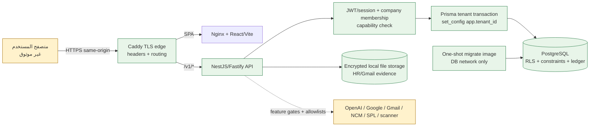
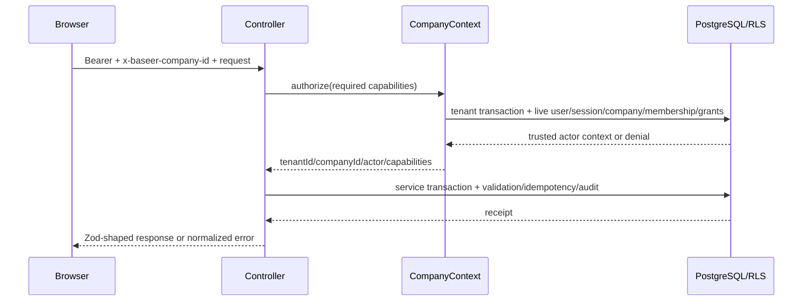
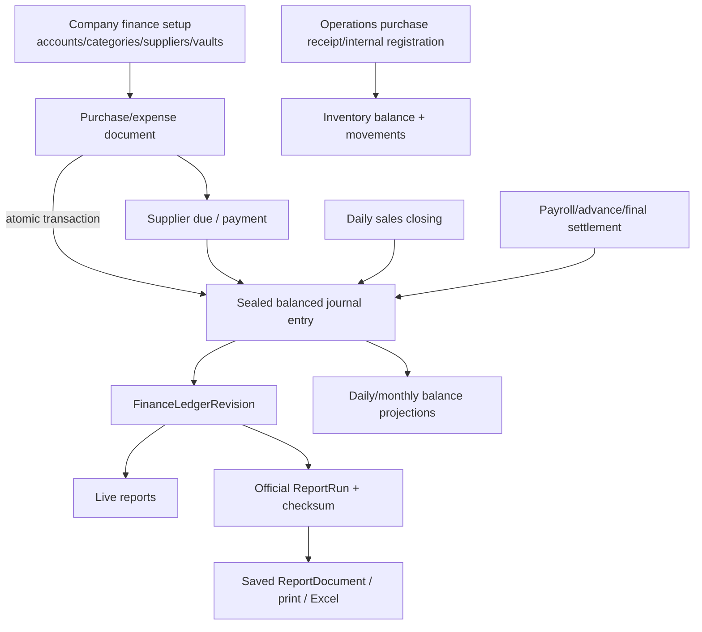

# المرحلة 2 — خريطة النظام

## لقطة تنفيذية

Baseer ERP مستودع npm workspaces لمونوليث معياري: SPA واحدة، API NestJS/Fastify واحدة، PostgreSQL واحدة لكل بيئة، وحزمتان داخليتان للعقود والمخرجات. جرد الشجرة الحالية وجد **46 controller** و**310 route decorators**، و**149 model** و**114 enum** في Prisma، و**51 صفحة** عبر 9 موديولات Web. هذه أعداد بنيوية وليست ادعاء تغطية أو اكتمال.

## خريطة المستودع

```text
apps/
  api/                  NestJS/Fastify + Prisma + كل نطاقات الأعمال
    prisma/             schema واحد + 116 migration + client مولد
    src/                17 نطاقاً/دليلاً وظيفياً
  web/                  React/Vite SPA + 51 صفحة + Playwright E2E
  shell/                نماذج static قديمة، غير داخلة في workspaces/صور الإنتاج
packages/
  contracts/            عقود Zod/TypeScript مشتركة
  output-platform/      print/Excel ومخرجات المحتوى
scripts/                حراس ثابتة وفحوص DB/HTTP وتشغيل محلي
docker/                 Caddy/Nginx وتهيئة دور قاعدة التطبيق
ops/private-online/     مثال environment فقط
docs/                   سلطة البناء والقبول والتدقيقات التاريخية
```

## معمارية التشغيل ومناطق الثقة



حدود الثقة:

1. كل browser input والـheaders وquery/body غير موثوق.
2. JWT يثبت هوية الجلسة، لكن الشركة والصلاحيات يعاد التحقق منهما من قاعدة البيانات لكل طلب (`company-context.service.ts:74-159`).
3. كل عمل tenant يمر بـ`inTenantTransaction` التي تضبط `app.tenant_id` داخل المعاملة (`database.service.ts:23-32`)؛ migrations تطبق RLS/FORCE RLS عبر 53 ملفاً.
4. PostgreSQL والدفتر المنشور هما مصدر الحقيقة المالي؛ الـSPA لا يُفترض أن ينشئ totals authoritative.
5. التخزين المحلي المشفر خارج PostgreSQL يحتاج مسار backup منفصلاً عن database backup.
6. الاتصالات الخارجية حدود ثقة منفصلة ومقفلة افتراضياً بمتغيرات بيئة، لكنها تدخل بيانات/مخرجات خارجية عندما تفعّل.

## نقطة الدخول والطلب



- API يبدأ بعد نجاح اتصال DB و`SELECT 1` (`main.ts:53-61`).
- prefix هو `/v1`، وCaddy يوجه المسار نفسه (`main.ts:38`؛ `Caddyfile.private-online:15-17`).
- Authentication: sign-in/refresh/sign-out، JWT access/refresh، `AppSession` وحالة/version للجلسة؛ كلمات المرور bcrypt.
- Authorization: tenant admin context لمسارات الإدارة؛ company context + capabilities لباقي الأعمال.
- Audit/idempotency: `AuditEvent` عام و`IdempotencyReceipt` مركزي مع receipts متخصصة في بعض النطاقات.

## الوحدات ومسؤولياتها

| النطاق | Controllers | المسؤولية والبيانات الرئيسية |
|---|---:|---|
| identity/company/admin | 3 | login/refresh/logout، الشركات والعضويات والأدوار والصلاحيات، سياق tenant/company |
| finance | 16 | الإعداد المالي، الحسابات، القيود والفترات، الموردون والمشتريات، الالتزامات، الخزائن، VAT، المبيعات اليومية والقروض |
| reports | 6 | catalog، live financial reads، official `ReportRun`، الأدلة والمستندات، trial balance/VAT/cash performance |
| HR | 5 | الموظفون، التعويض، الرواتب، الإجازات، السلف والخصومات، المخالصات، المستندات والخطابات |
| operations | 5 | الأصناف والوحدات والوصفات، الطلب/الاستلام، المخزون، العهدة، التسجيل الداخلي، الأصول/الضمان |
| decision intelligence | 1 | metrics، context، alerts، evidence snapshots، feedback/import/research |
| marketing | 1 | campaigns، targets، finance/context links، reputation/provider state |
| inbound evidence | 1 | Gmail OAuth/read-only sync، labels/rules، encrypted attachments، document analysis |
| AI platform | 2 | provider vault/config، skills، budgets، receipts، interpretations/evaluations |
| command/owner brief | 1 + web | تجميع reads، لقطة دفتر المالك اليومية المجدولة |
| platform support | 5 | business date، file metadata، output، health، observability |

## تدفقات ERP الحرجة



نقاط الفشل الحرجة: المعاملة المشتركة بين المستند والقيد/الرصيد، تسلسل المستندات، قفل الفترة، revision الدفتر، RLS، وتناسق `ReportRun` مع المستند النهائي.

## التكاملات والمهام المجدولة والتخزين

- OpenAI: adapter server-only مع timeouts/retries محدودة؛ قرار وMarketing pilots مقفولان بمتغيري بيئة (`ai-runtime.service.ts:248,572`).
- Gmail: OAuth scope قراءة فقط، tokens مشفرة، sync وattachments؛ مقفول بـ`BASEER_GMAIL_OAUTH_ENABLED` (`inbound-evidence-gmail.service.ts:21,35-36`).
- Google Marketing OAuth: UI/controller experiment gate منفصل وplatform config gate؛ لا يوجد دليل تشغيل إنتاجي.
- Decision context: مصادر NCM/SPL ثابتة/allowlisted وimports؛ schedulers مقفلة بمتغيرات البيئة (`decision-context-*.service.ts`).
- Owner daily brief: scheduler داخل API باستخدام durable DB lease، مع بوابة بيئة (`owner-daily-brief-scheduler.service.ts:23-54`).
- الملفات: مستندات موظفين حتى 5 MiB ومرفقات inbound حتى 15 MiB، magic MIME/path confinement، تشفير، scanner، وحالة quarantine عند غياب/فشل scanner (`hr-employee-document.service.ts:14,102-113`؛ `inbound-evidence-gmail.service.ts:19,254-259`).

## التشغيل والنشر

- صورة API runtime غير root/read-only ولا تحتوي toolchain Prisma؛ صورة migrate one-shot منفصلة.
- PostgreSQL على شبكة داخلية، ودور التطبيق المقيد ينشأ عند التهيئة.
- Caddy هو السطح العام الوحيد ويفرض TLS/headers.
- health liveness وreadiness موجودان؛ observability يجمع metrics في الذاكرة ويسجل JSON إلى stdout.
- توجد وثائق baseline وrelease/recovery/incident وprivate-online تحت `docs/operations/`، وشهادة restore اصطناعية محلية قديمة؛ لا توجد خدمة collector/alert ولا backup job/restore receipt حديث للمخطط الحالي أو بيئة الإنتاج.

## حالة الاكتمال حسب الدليل الحالي

| النطاق | الحالة العملية |
|---|---|
| الهوية/الشركات/RBAC/الإدارة الأساسية | مكتملة ومقبولة محلياً؛ الإنتاج والتحقق الحالي منفصلان |
| المالية والمشتريات/الخزائن/المبيعات اليومية | مكتملة ومقبولة محلياً ضمن النطاق المسجل؛ لا يشمل bank connectivity أو tax codes متعددة أو scale |
| HR | مكتملة ومقبولة محلياً؛ تشغيل قاعدة جديدة يحتاج إعادة RLS/gates |
| Operations | مكتملة ومقبولة محلياً؛ asset accounting/attachments الخارجية خارج النطاق |
| Reports/Decision/Command | مكتملة محلياً ضمن العقود المسجلة؛ تغييرات hybrid reporting الحالية تحتاج تحقق |
| Marketing | أساس داخلي موجود؛ الاتصالات الحية/publishing/spend خارج النطاق أو feature-gated |
| Inbound Evidence/Gmail | مسار متقدم لكنه تكامل خارجي مشروط ومقفول افتراضياً؛ ليس ضمن قبول الإنتاج المثبت |
| Basira/AI | بعض skills READY/SERVER_GATED وبعضها `NOT_IMPLEMENTED` معلن؛ pilots فقط وليست قدرة إنتاج عامة |
| Schedulers | مبنية ومقفلة افتراضياً؛ لا دليل HA/تشغيل/تنبيه فعلي |
| Noorix migration/cutover | غير منفذ ومقصود خارج النطاق الحالي |
| Backup/restore/rollback | غير مكتمل ويمنع اعتماد التشغيل الإنتاجي |
| Hajri Tax | **غير مكتمل لكنه ظاهر**: الصفحة مسجلة ومرئية ولا route workspace لها |
| صفحة Backup في الإدارة | **غير مكتملة لكنها ظاهرة**: section 5 مسجل، بينما `AdministrationWorkspace` يعالج 1–4 فقط ويسقط إلى Overview (`administration-workspace.tsx:38`) |

## تحقق معايير القبول

- [x] البنية والوحدات ونقاط الدخول والـAPI والبيانات موثقة.
- [x] المصادقة والصلاحيات والتخزين والتكاملات والمهام والنشر محددة.
- [x] تدفقات البيانات ومناطق الثقة ونقاط الفشل الحرجة مرسومة.
- [x] الوحدات المكتملة مفصولة عن التجريبية/المقفلة/غير المكتملة.
